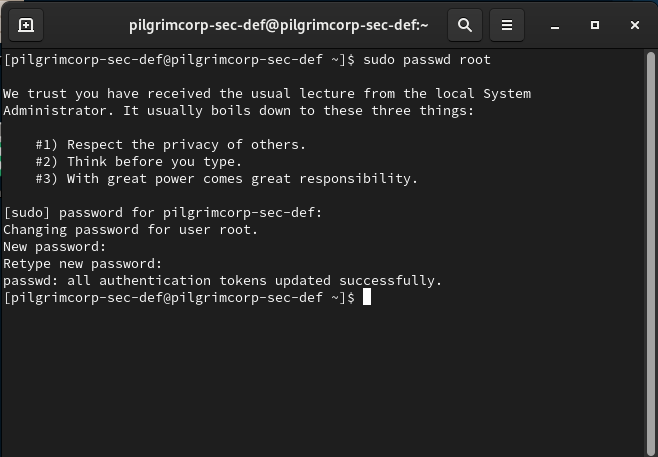

Security Onion is an OS based on Debian Linux and is primarily used for defensive security. We will not connect it to the Domain Controller.
## Installation
We will install the **Desktop** version when prompted to select an OS version to install.
> [!Warning] Disk Space
> Security Onion needs at least 49 GB of space to install, so when creating the VM, we will use 55 GB of space.

When prompted, type `yes` to wipe the entire disk (of the VM don't worry) and install.
We will use the Administrator username as `pilgrimcorp-sec-def` and password as `@password123!`

After reboot, it will ask for the `localhost` login. Input our username and password to continue.

Now we have to follow the Security Onion setup wizard.

In the first screen, select `Yes` and continue.

Enter the `hostname` as `pilgrimcorp-sec-def` and continue.

In the NIC selection screen, our Ethernet card must already be selected. Just go to OK and continue.
### Static IP
In the next screen, Security Onion will ask about the management interface. Here, we will select `STATIC Set a static IPv4 address (recommneded)`.


Based on our IP schema from the [[Learning/Cybersecurity/Homelab/Intro|Intro]], we will use this IP Address


For the default gateway, we will use the IP `10.0.0.1`

Leave the DNS servers unchanged.

For the DNS Search Domain, we will use `corp.pilgrimcorp-dc.com`

In the next screen, Security Onion asks whether we want to join an existing grid. Select **No**. Security Onion will then warn us that we have selected it to be independent. As for the question `Would you still like to have the graphical interface loaded at boot?` select **Yes**

To load the GUI, we will reboot the VM.
```bash
reboot
```

Once the system has rebooted, we should see the login screen like this


Let's login and then we need to set the `root` password. To do this, we will open the **Terminal**
```bash
sudo passwd root
```

First it will ask for your local password to continue. Input `@password123!` and then for the new password for the user `root`, we will use the same password again.



We can exit the terminal and we are ready to take a snapshot of this defensive setup and call it `base`.