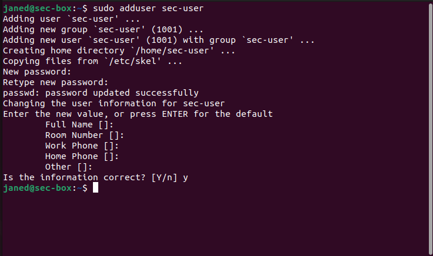
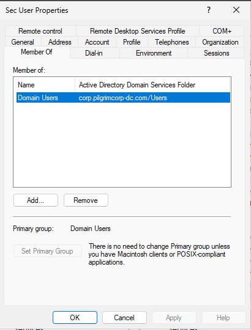
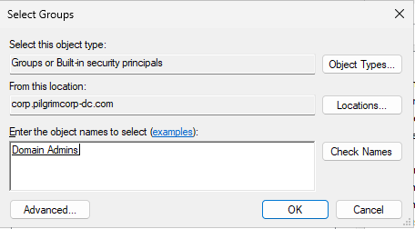
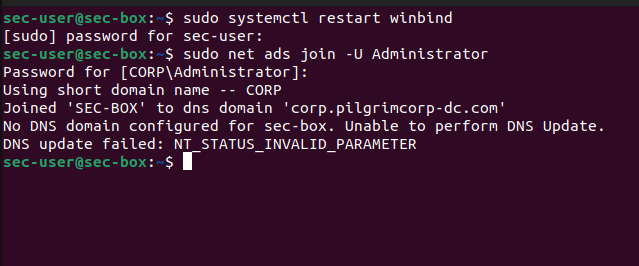
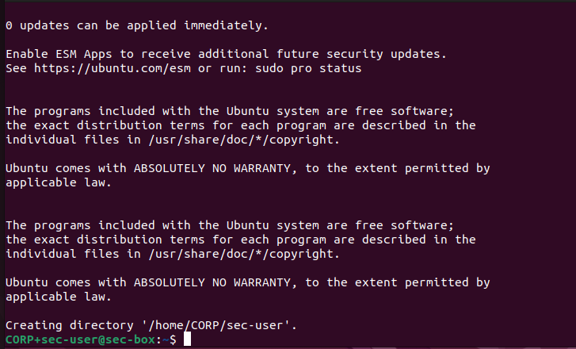

Why do we want to provision a dedicated security server?
- **Isolation** - Running resource-intensive tools on a dedicated server prevents performance degradations caused by workloads on shared resources. Each application demands significant CPU, RAM and disk I/O to function efficiently.
- **Security Context** - Security tools process sensitive data, including logs and vulnerability scans. A dedicated server isolates sensitive data from unrelated systems.
- **Centralized Management** - Simplifies monitoring and management, providing a single point for handling logs, alerts and vulnerability data.
## Provision VM
To provision this VM, which is based on Ubuntu Desktop 22.04, which we have already provisioned once, we will use the **Clone** option in VirtualBox.

Right click on our **pilgrimcorp-linux-client** and choose **Clone**. Change the name to **pilgrimcorp-sec-box** and leave the rest as it is. It will take some time to clone the machine.
## Setup user and account
Because we cloned this machine, once we start the VM and login, we will see that our user is actually `janed@linux-client`. We will need to change the user, the hostname and rejoin Active Directory and create another user in Active Directory called `sec-box`.
### Change Hostname
To do this, we need to edit the `hostname` file.
```bash
sudo nano /etc/hostname
```

When prompted for password, we will use our standard password, `@password123!`.  Replace `pilgrimcorp-lc` with `sec-box`.  Reboot the VM.
### Change Account
We will change the user from `janed` to `sec-user`.
```bash
sudo adduser sec-user
```

When prompted to add a new password, use our same password `@password123!`. We don't need to fill in any other information for the user.



### Add `sec-user` to `sudo` group
We do this so we can use elevated privileges to run commands.
```bash
sudo usermod -aG sudo sec-user
```

Now change into the new user
```bash
su sec-user
```

Enter the password when prompted. You will now see your new user
```bash
sec-user@sec-box:/home/janed$
```

Let's change into our home directory, as that's where we will be running our commands to join Active Directory.
### Change Static IP
Since we cloned this machine from another machine, this machine will have the Static IP that we configured for the other VM. Let's change the Static IP for this machine, which is `10.0.0.10`. Follow the exact same steps as we followed in [Ubuntu Desktop 22.04 Static IP](./Ubuntu Desktop 22.04#StaticIP)
### New Account in Active Directory
Follow the steps in [[Windows Server 2025#Active Directory Users]] to create a new account in AD. We will use these settings

| Detail   | Value           |
| -------- | --------------- |
| user     | sec-work        |
| password | `@password123!` |
### Change User Group in Active Directory
Currently, this user is part of `Domain Users` group. We can see this when we right click and go to **Properties** of the user and then to the **Member of** tab.



Click on **Add**. In the section **Enter the object names to select**, type **Domain Admins** and click on **Check Names**. You will see that Domain Admins with an underline comes up.



Click OK. We will see that the user has been added to the group **Domain Admins**. Click Apply and Ok to exit the windows.

### Join Active Directory
Since this is a clone machine, our setup of joining the Active Directory Domain Controller has already been done. However, we need to clear the cache and rejoin as the new user.
```bash
sudo systemctl restart winbind
```

Then we will follow the same commands to join as we did earlier
```bash
sudo net ads join -U Administrator
```

Enter the `CORP\Administrator` password to join the Domain Controller.



Restart `winbind` again. Use the command `wbinfo -u` to see the new user added.
### Login to Domain Controller
```bash
sudo login
```

When prompted for `sec-box-login` use `CORP+sec-user` and password `@password123!`.



We will create a snapshot here and call it `Sec server base + AD`.