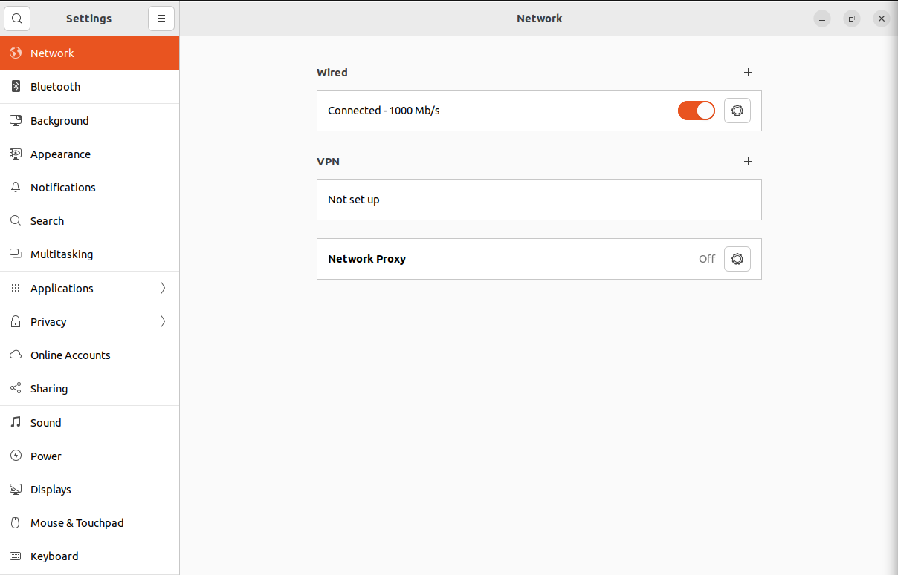

This linux workstation is going to be used by our other user Jane Doe. While installing Linux, we need to use this name.

> **VM Network**
> Ensure in VirtualBox that the Network for this Ubuntu client is correctly selected as NAT Network with the network name of `pilgrimcorp-network`. Failing this, joining the Active Directory will fail.

![[Screenshot from 2025-03-05 15-51-13.png]]
Use the name **~~pilgrimcorp-linux-client~~**  **pilgrimcorp-lc** as the computer name and input our password **@password123!**. Ignore Ubuntu's suggestion that this is a strong password.
Select **Log in automatically**.

> **Computer Name**
> Due to the NetBIOS limitation, we cannot use the name `pilgrimcorp-linux-client` as it is very long. Therefore, we will use the shorter name.

Once Ubuntu is installed and restarted, skip through the initial setup windows like Online Accounts and Ubuntu Pro.

Go to **Settings** > **Power** and change the **Screen Blank** to **Never**. This is because we will be doing a lot of back and forth between VMs and Ubuntu will lock you out upon screen blank so it might become annoying logging in every time.
## Static IP
Just like the Windows machines, we will assign a static IP to this client as well. To do this, go to **Network** which is at the very top of settings in the left pane. You will see a Wired Connection which is turned on.   



Click on the little gear icon next to the toggle switch to open a window like this


Now, click on **IPv4**. Use these settings and then click **Apply**.


Once again at this point, we will take a snapshot and call this as the `base` configuration for our Ubuntu Linux Client.
## Connect to Active Directory
We will use Samba/Winbind libraries to achieve this.
### 01 - Install Necessary Packages
To make this work, we will need to install these packages in the Linux Client. Open up **Terminal** in the Ubuntu VM and paste this.
```zsh
sudo apt install winbind libpam-winbind libnss-winbind krb5-config samba-dsdb-modules samba-vfs-modules
```

When this screen appears, we will input our Domain Controller address.


In the remaining two screens similar to this that follow, input the same address. The installation process will continue. Once the installation is complete, we need to rename the `smb.conf.org` file.

```zsh
sudo mv /etc/samba/smb.conf /etc/samba/smb.conf.org
```
### 02 - Edit `smb.conf` file
We need to make modifications to the configuration file to match our domain controller. To do this, we will use the **nano** editor in the terminal. 
```zsh
sudo nano /etc/samba/smb.conf
```

Copy paste the following configuration in the file

```conf
[global]
   kerberos method = secrets and keytab
   realm = corp.pilgrimcorp-dc.com
   workgroup = CORP
   security = ads
   template shell = /bin/bash
   winbind enum groups = Yes
   winbind enum users = Yes
   winbind separator = +
   idmap config * : rangesize = 1000000
   idmap config * : range = 1000000-19999999
   idmap config * : backend = autorid
```

### 03 - Confirm `passwd` and `group` have `winbind`
```zsh
sudo nano /etc/nsswitch.conf
```

If `winbind` does not exist, then you can add it after `systemd` like this.


### 04 - Home Directory
On Ubuntu, every user that has an interactive logon to the system must have a **Home** directory. For domain users, we need to set this before a user is able to successfully logon and start working. To do this, we will use the following command
```zsh
sudo pam-auth-update
```

Scroll down and select **Create home directory on login** and use `Tab` to go to **OK** and press enter. A selected option will be filled with an asterisk like this `[*]`.
### 05 - DNS Settings
Now we will change the DNS to point to our Active Directory server. Remember that the DNS address is `10.0.0.5`. To do this, we need to edit the `resolv.conf` file.
```shell
sudo nano /etc/resolv.conf
```

Add the following line on top of the file.
```conf
nameserver 10.0.0.5
```
### 06 - Join the Domain
We need to join the Domain Controller as an Administrator first and then we can logon as our user Jane Doe. To do this, we will use the following command:
```zsh
sudo net ads join -U Administrator
```

You will be asked to enter the password for the `CORP\Administrator` account. If everything worked fine, we should see the Ubuntu client added to Active Directory.


For now, we can ignore the error messages regarding the DNS.

To login to Active Directory, we need to do the following:
```bash
sudo login
```

In the next prompt input
```bash
CORP+janed
```
When asked for password, input Jane Doe's password which was created from the Domain Controller.
