Initially, we follow the same steps in VirtualBox to provision the Ubuntu Server. Refer to the [[Learning/Cybersecurity/Homelab/Intro|Intro]] to understand the system requirements.
## Install Setup
Once the installation has booted up, we will proceed with the following options on each screen.
Keep the language as **English** and press enter.

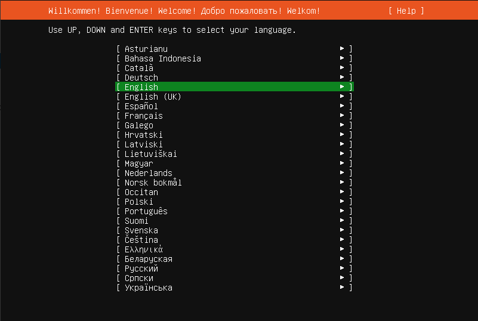

In the next step, select **Continue without updating**. In the keyboard configuration, leave the defaults as it is and press Enter on **Done**

In **Type of Installation**, keep the selection as **Ubuntu Server** and press Enter on **Done**.

In the **Network Configuration**, keep the settings as selected because we will change the settings later once the server is up and running.

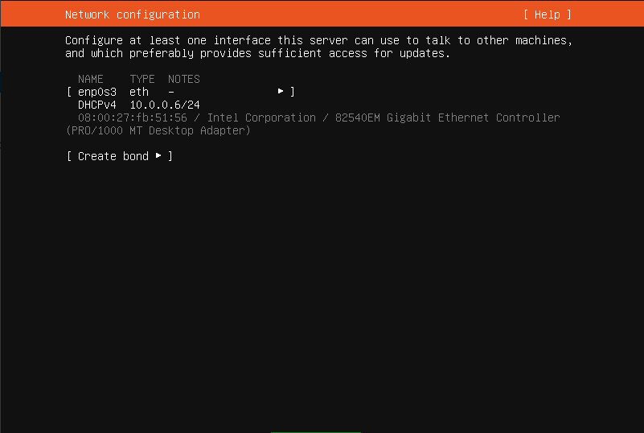

Leave the **Proxy Address** as blank.

In the **Mirror Configuration**, it will test for a package archive mirror. Let it finish but don't change anything. Press enter when it finishes and displays **This mirror location passed tests**.

In **Guided Storage Configuration**, leave the setting to use **Use an entire disk** and proceed. Press the `Tab` key if **Done** is not highlighted initially.

Once again, in **Storage Configuration**, leave the setting at defaults and proceed.

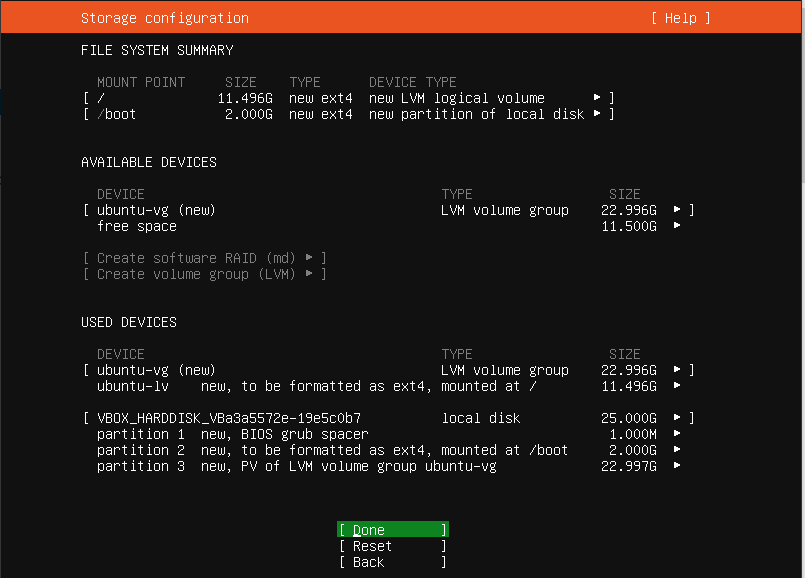

In the popup dialog **Confirm Destructive Action**, press the `Down` arrow key to move the highlight to **Continue** and proceed.

The installation will then come at **Profile Configuration**. Fill in the information according to this screenshot. The password remains the same as mentioned in [[Learning/Cybersecurity/Homelab/Intro|Intro]]

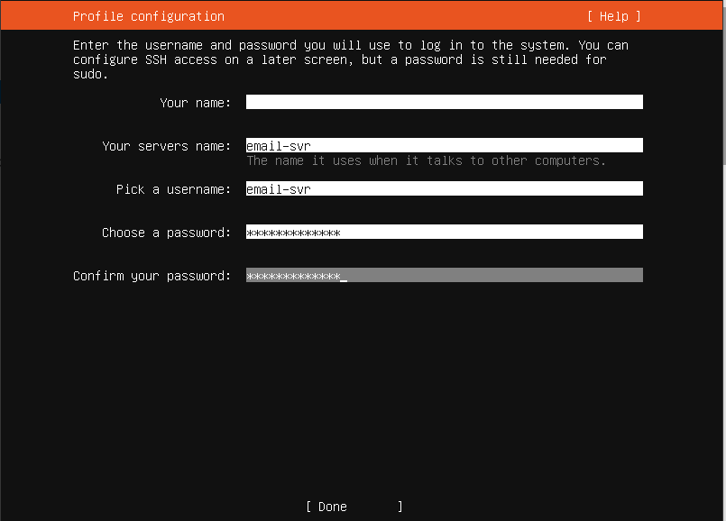

Click on Done to proceed. In the next screen, **Upgrade to Ubuntu Pro**, leave the setting at default, which is **Skip for now**, and proceed.

In the **SSH Configuration** screen, note that **Install OpenSSH Server** is unselected. You can select this using `Space` key and use the `Tab` key to move to **Done** and proceed.

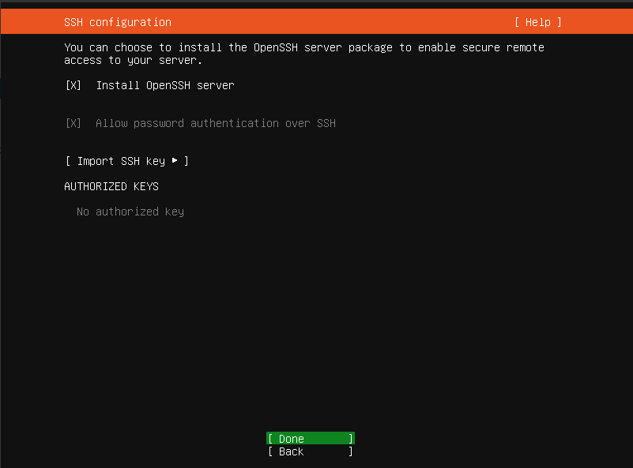

In the **Featured Server Snaps**, leave everything unselected (default) and use the `Tab` key to move to **Done** and proceed.

Ubuntu will now proceed to installing the system. Once the installation is complete, once again use the `Tab` key to go to **Reboot Now** and reboot the system.

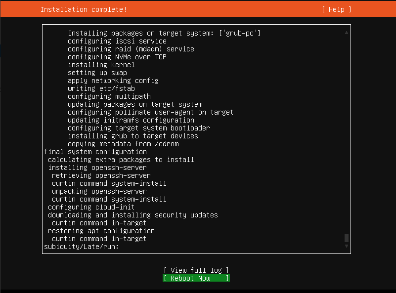

## Create Account in DC
While we wait for Ubuntu Server to reboot, we will create a new account in our Domain Controller.

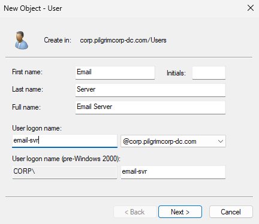

Once again, we will use the settings **User cannot change password** and **Password never expires** in the next screen. Use the same password (`@password123!`).

Go back to your Ubuntu Server, press `Enter` and login using the **local credentials** created during the setup. For reference, the credentials were `email-svr` as the username and `@password123!` as the password. Once successful, you should see a screen like this.

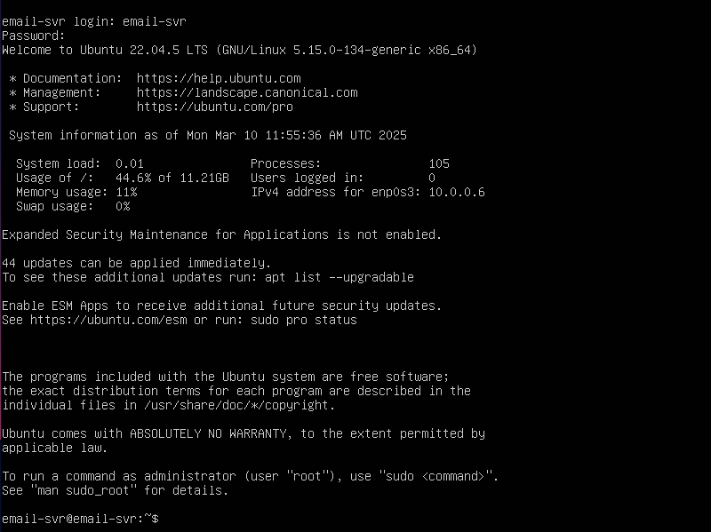

To proceed further, we will first update the Ubuntu Server system.
```bash
sudo apt update
```

If the system shows there are updates available, we will update them using this command.
```bash
sudo apt upgrade -y
```
## Change to Static IP
Like with every other machine, we will convert this server to have a static IP address. To do this, we need to use a little utility called **netplan**.

First, we need to create a new file in the `netplan` directory.
```bash
sudo nano /etc/netplan/01-netcfg.yaml
```

> **New YAML Config File**
> We need to use another YAML config file so that when the server reboots, the network configuration isn't lost. If we simply make changes to the original `50-cloud-init.yaml` file, it will be reset upon a reboot and we will lose our Static IP.

Use the following settings in the yaml file.
```yaml
network:
  ethernets:
    enp0s3:
      dhcp4: false
      addresses:
        - 10.0.0.8/24 # Static IP of Ubuntu Server
      routes:
        - to: default
          via: 10.0.0.1 # Gateway Address
      nameservers:
        addresses: 
          - 10.0.0.5 # Our Domain Controller DNS
          - 8.8.8.8 # Google DNS Server
  version: 2
```

Now, we will rename the original file contained in the `netplan` directory.
```bash
sudo mv 50-cloud-init.yaml 50-cloud-init.yaml.backup
```

This is the original file that will be converted into a backup in case something does not work correctly.

> **DNS Server**
> Like we did in the Ubuntu Client, you can change the DNS by using the `/etc/resolv.conf` file and add our Domain Controller's IP `10.0.0.5` as the nameserver. Otherwise, if you use the configuration from the above YAML file, there is no need to do this when you go to the next step of installing Winbind and Samba services to join the Domain Controller.

Once you have made changes, press `Ctrl + x` and then `y` to save and exit out of the file. Now it's time to apply the new configuration.
```bash
sudo netplan try
```

It may ask for your password. Once done, you should see a screen like this:

> **Regarding `gateway4`**
> In the Netplan utility, `gateway4` has been deprecated. This screenshot was captured when using `gateway4` in the YAML file. Please refer to the above YAML file configuration to use the new method `route`. In this case, the warnings below will not appear.

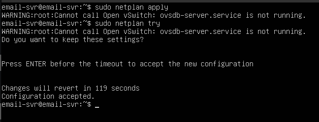

To verify that the Static IP has been assigned correctly, use this command
```bash
ip a
```

It should display the currently assigned IP to the `enp0s3` network card.

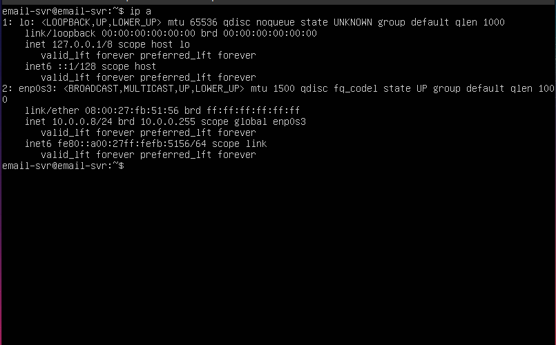

Now, ping the Domain Controller at the IP `10.0.0.5` and we should have a response.
## Connect to Active Directory
We will follow the same steps as we did in connecting the Ubuntu Desktop, so you can safely follow the instructions mentioned there. [[Ubuntu Desktop 22.04#Connect to Active Directory]]
### Login to Active Directory
To login, similar to the Ubuntu Client we will do the following
```bash
sudo login
```

In the next prompt, input
```bash
CORP+email-svr
```

Once we login, you will notice that a home directory has been created and you should see a screen like this.

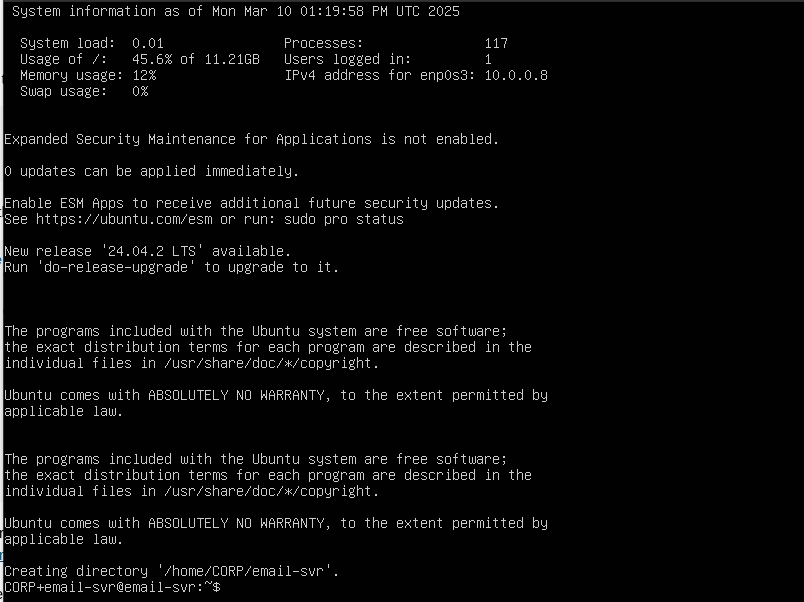

This is a baseline configuration of our Ubuntu Server, so here, we will create a snapshot.