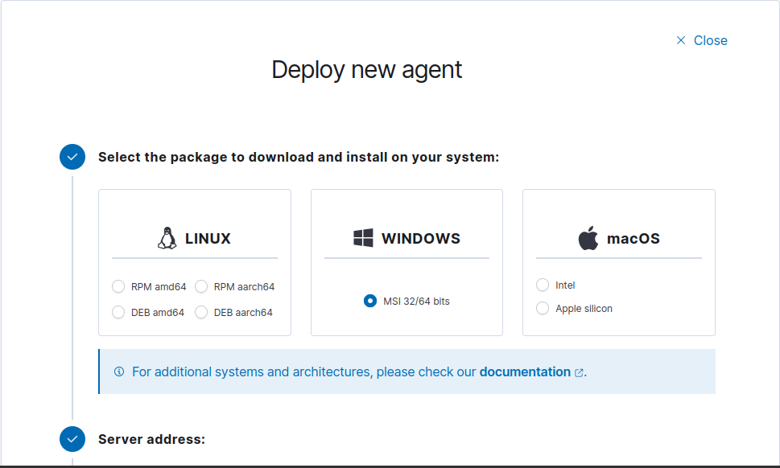
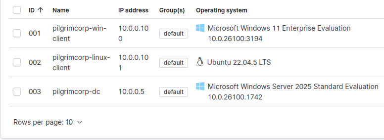

## Install Wazuh
To install Wazuh, use the following command. This will install both `server` and `dashboard`.
```bash
curl -sO https://packages.wazuh.com/4.9/wazuh-install.sh && sudo bash ./wazuh-install.sh -a -i
```

> **Storage Size**
> Wazuh needs a lot of storage to function. Make sure your VM is at least 75 Gb

Once installation finishes, take note of the username and password. You can create a new file in your home directory and paste the password there.
```bash
nano wazuh-password.txt
```
## Web Interface
Once the installation has finished, we will fire up Firefox and initiate the web dashboard of Wazuh. To do this, we need to go to `localhost`. 

Firefox will show a **Warning: Potential Security Risk Ahead**. This is because we are trying to access a secure installation using the `https` protocol without using a known certificate backing it up, that is, the certificate is self-signed. For now, click on **Advanced...** and then **Accept the Risk and Continue**.

You will see a Wazuh loading screen and eventually you'll end up on the login screen. Use the user and password we noted earlier from the terminal.

Once logged in, Wazuh will make a few checks and then show the dashboard like so.


We now have the central dashboard and server of Wazuh setup. In order to get data from other computers into here, we need to install Wazuh agents in each of them so they can log the data and send it over to our central server.

Wazuh will then aggregate all the data, parse it, normalize it and make it human readable for us.
## Deploy Wazuh Agents
Go to the Wazuh dashboard and on the left side click on the menu and go to **Server Management** and click on the first item, **Endpoints Summary**


You will see a page like this where there is a **Deploy new agent** button. Click on it. 

### Wazuh Windows Agent
We will start with Windows first.



Click on **MSI 32/64 bits** which should be the in the middle box titled Windows.

In the **Assign a server address**, input the IP `10.0.0.10` which is our `sec-box` IP. In the **Assign an agent name**, we will use the respective hostname of our machine, `pilgrimcorp-win-client`.


Finally, from the group selection, click on the dropdown and select **Default**.

Once we do everything, a PowerShell query will have been generated for us. 


```powershell
Invoke-WebRequest -Uri https://packages.wazuh.com/4.x/windows/wazuh-agent-4.9.2-1.msi -OutFile $env:tmp\wazuh-agent; msiexec.exe /i $env:tmp\wazuh-agent /q WAZUH_MANAGER='10.0.0.10' WAZUH_AGENT_GROUP='default' WAZUH_AGENT_NAME='pilgrimcorp-win-client'
```

Make sure the Windows Client VM is turned on. It doesn't matter which account is logged in as we will run the command as an Administrator anyway.

In the bottom search bar, search for **PowerShell**, right click on it and click on **Run as Administrator**

In the UAC screen, input the credentials of our CORP Administrator account. PowerShell will now be started with admin privileges.

Paste the above command and press `Enter`


Once the installation is done, we will start the Wazuh service.
```PowerShell
NET START WazuhSvc
```

PowerShell will output that the `Wazuh service was started successfully`.

Now, we can go back to our Wazuh dashboard in the sec box and see the new agent added.


Take a snapshot of the `win-client` VM and add `+wazuh-agent` in the name and power off the client. Now, we will repeat this for the Ubuntu client.
### Wazuh Ubuntu Agent
While on the same screen in the Wazuh Dashboard, click on the button **Deploy New Agent** and this time, select **DEB amd64** under the Linux box.

Use the agent name as `pilgrimcorp-linux-client`. The rest of the settings remain the same as we used for the Windows client. 

Now it's time to input the generated code in our Ubuntu Client machine.
```bash
wget https://packages.wazuh.com/4.x/apt/pool/main/w/wazuh-agent/wazuh-agent_4.9.2-1_amd64.deb && sudo WAZUH_MANAGER='10.0.0.10' WAZUH_AGENT_GROUP='default' WAZUH_AGENT_NAME='pilgrimcorp-linux-client' dpkg -i ./wazuh-agent_4.9.2-1.deb
```

As suggested by the Wazuh server, we will need to enable and start the agent.
```bash
sudo systemctl daemon-reload
sudo systemctl enable wazuh-agent
sudo systemctl start wazuh-agent
```

Once we input all these three commands, we will go back to our Wazuh Dashboard to see our new Linux client being added in the agents list.


Once again, take a snapshot.

We will now connect the Domain Controller to the Wazuh dashboard. We can repeat the same steps as we did for the Windows client.

```PowerShell
Invoke-WebRequest -Uri https://packages.wazuh.com/4.x/windows/wazuh-agent-4.9.2-1.msi -OutFile $env:tmp\wazuh-agent; msiexec.exe /i $env:tmp\wazuh-agent /q WAZUH_MANAGER='10.0.0.10' WAZUH_AGENT_GROUP='default' WAZUH_AGENT_NAME='pilgrimcorp-dc'
```

And once again, we can see our Windows Server machine, our Domain Controller, in the agents list.



## Change the `default` Groups
Groups can help us streamline and gather various agents based on characteristics. In a real world scenario, these could be groups based on department or location, etc.

We will add the machines in their respective OS groups to gather data respective to each OS. To do this, we will go to **Menu** > **Server Management** > **Endpoint Groups**.

Click on **Add New Group** and create a group called `Windows` and another one called `Linux`.

To add the agents to their respective groups, go back to **Endpoint Summary**. In the Agents section, at the very end of the screen on the right side, you will see an **Actions** column. Under that, click on the 3 dots and select **Edit Groups**.

Select the correct OS for each agent and save it. Be sure to remove the `default` group from each agent.
## Apply Configuration
Now we will apply specific configurations to each group in order to gather data specific to that particular OS. To do this, we need to work with the `agent.conf` file which will act as our central point to distribute the configuration to all our agents.
### Windows Group Conf
Go to **Menu** > **Endpoint Groups** > **Windows** > **Files**


Click on the little pencil for the `agent.conf` file and add the following configuration just below the `<!-- Shared Agent configuration here -->` line.

```html
<agent_config>
	<!-- Shared agent configuration here -->
	<localfile>
		<location>Security</location>
		<log_format>eventchannel</log_format>
	</localfile>
	<localfile>
		<location>Application</location>
		<log_format>eventchannel</log_format>
	</localfile>
</agent_config>
```

Save this file.
### Linux Group Conf
Similarly, we will add this configuration to the Linux group
```html
<agent_config>
	<!-- Shared agent configuration here -->
	<localfile>
		<log_format>syslog</log_format>
		<location>/var/log/auth.log</location>
	</localfile>
	<localfile>
		<log_format>syslog</log_format>
		<location>/var/log/secure</location>
	</localfile>
	<localfile>
		<log_format>audit</log_format>
		<location>/var/log/audit/audit.log</location>
	</localfile>
<agent_config>
```

We can now to go to **Menu** > **Explore** > **Discover** and we can already see some logs starting to appear.
> [!Note]
> If your other two machines were powered off, you will need to power them back on to start receiving logs from them.


Let's take a snapshot here.