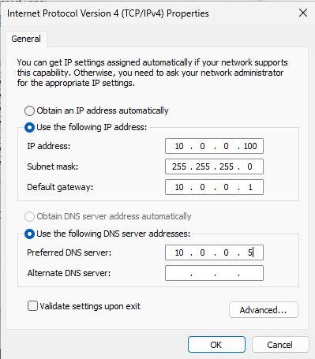
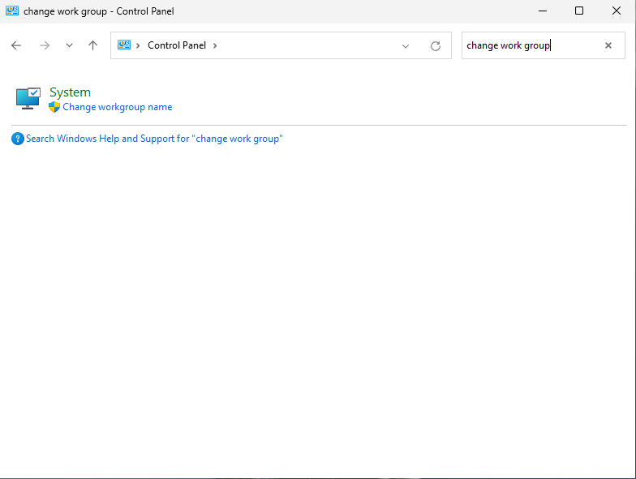
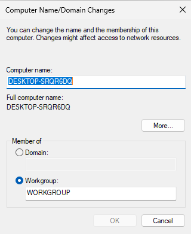
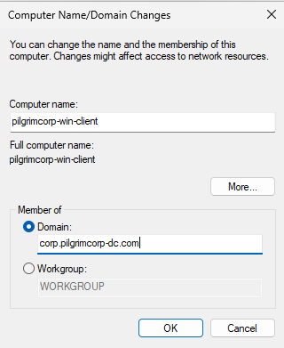
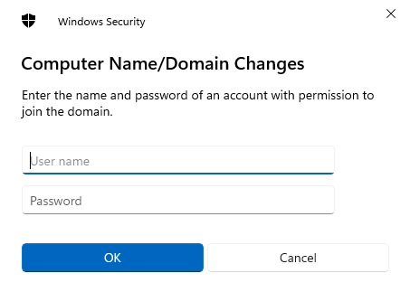
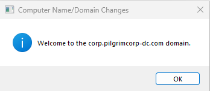
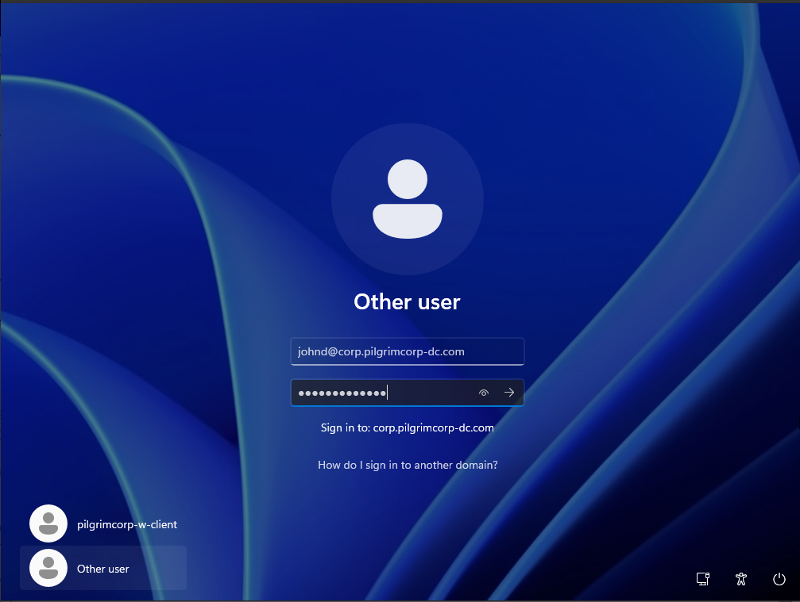

This VM will work as a workstation. Think of companies issuing laptops / desktops to their employees. These Windows workstations can be controlled from Active Directory.
## Initial Install
Follow the initial Windows installation procedure normally. When you get to the **Sign In** screen asking you to sign in to your Microsoft Account, we need to skip that part by doing the following things.
1. Go to **Machine** > **Settings** > **Network** and select **Host Only Adapter** or **Not Attached**. This will disable the internet connection.
2. Inside the VM, press `shift` + `F10` to open up the **command prompt**. Type the command `oobe\bypassnro` to restart the Windows Installation and continue without Microsoft Account prompt.
Once done, you will see this screen instead of the Microsoft Account sign in.
![[Screenshot from 2025-03-05 12-35-01.png]]
Select **I don't have internet**.
On the next screen, it will ask us to input the name. We will use **pilgrimcorp-w-client** since **pilgrimcorp-win-client** is too long for Windows.
Input the password as **@password123!**. Enter the answers to the 3 security questions as you like.
![[Screenshot from 2025-03-05 12-40-15.png]]
Un check all the privacy settings as we don't want to share all these with Microsoft. After this, Windows will do some settings and then land on the desktop.

We need to restart the network to be able to join the Active Directory server. Similar to how we stopped the network, we will go back to **Machine** > **Settings** > **Network** and select **NAT Network**. Note that the network **pilgrimcorp-network** will already be available and selected in Name. Once we do this, we can see the VM being connected to the internet.
## Add to Active Directory Domain
First, we have to set up a static IP address for this client. To do this, refer to this [[Windows Server 2025#Configure Static IP]]

Here are the settings for this Windows client.

Now, to add this client to Active Directory, we will go back to **Control Panel**. In the search bar, search for **change work group**

In the window that opens up, click on **Change**. In the subsequent window, we will see a random name assigned to our computer. We will change this to **pilgrimcorp-win-client**.

And we will change the **Member of** from `Workgroup` to our AD Domain, which is **corp.pilgrimcorp-dc.com**.

When you click OK, there might be a warning dialog about a NetBIOS limitation, click OK.

> **Domain Controller**
> When we do this step, we need to ensure that our Win Server Domain Controller is running. If it isn't, our client will encounter an error.

If everything is done correctly, we should see this screen.

This is where we will input the User John Doe that we created earlier. For reference, we created the  user `johnd@corp.pilgrimcorp-dc.com` with the password `@password123!`

If everything went smoothly, we should see this welcome dialog.

We need to restart the PC to apply the changes. When prompted, click on Restart Now.

When the computer restarts, we will first see the default account that we had created while installing Windows, in this case, `pilgrimcorp-w-client`.

We will use the **Other User** option to sign in as our John Doe account.

> **Full Domain while Login**
> You DO NOT need to input the entire domain name to login to the domain. 

Once we login, it will re-provision the settings like it did the first time for the local account and take us to the Windows desktop, but this time, as John Doe. We have successfully joined the client to the Active Directory Domain Controller server.

At this point, we will also take a snapshot of this VM and once again, call it `base`.

[Windows Server 2025](./Windows Server 2025.md) << Previous | Next >> [Ubuntu Desktop 22.04](./Ubuntu Desktop 22.04.md)