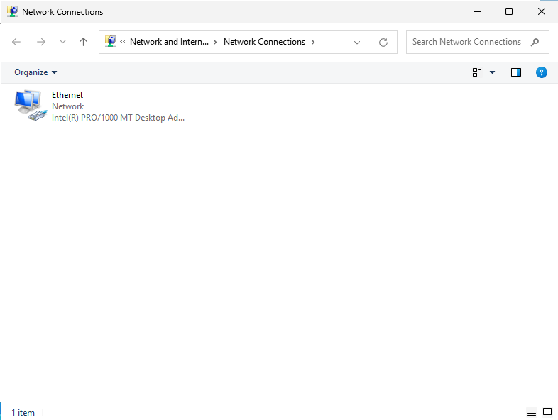
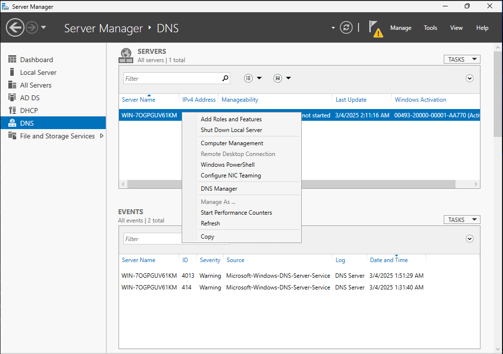
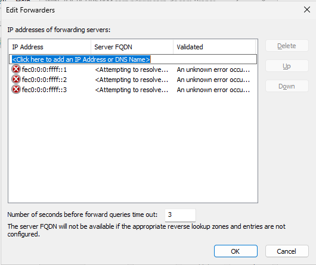
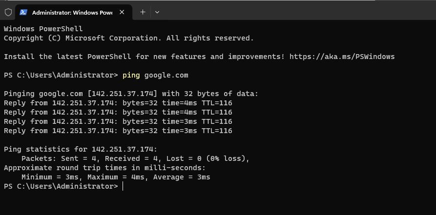
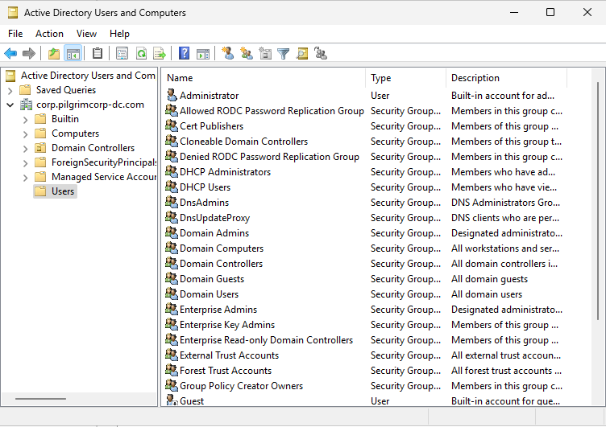

## Configure Static IP
Since we are working with static IPs in our homelab, we will configure one for our server. To configure static IP, we will go to **Control Panel** > **Network and Internet** > **Network and Sharing Center**

In the left pane, click on **Change adapter settings** and then double click on the **Ethernet** adapter.

In the window that opens, click on **Properties** and the select **Internet Protocol Version 4 (TCP/IPv4)**.

Click on **Properties** and input the following settings and click OK.

## Install Services
We will install Active Directory, DHCP and DNS services on this server. To do this, in the Server Manager window, click on **Manage** in the top right corner and select **Add Roles and Features**.

Select **Role-based or feature-based installation** and click next.
In the next window, **Select destination server**, select your server and click next.
In the **Select server roles** window, select **Active Directory Domain Service (ADDS)**, **DHCP** and **DNS** and click next and finish the installation.

## Setup Active Directory
Since we will use this server as the Domain Controller for our network, we need to promote this server to a Domain Controller. Once the installation of AD DS, DHCP and DNS is complete, follow these steps to promote the server.

> **Root Domain Name**
> Notice we are using the root domain name as `corp.pilgrimcorp-dc.com`. This is the same domain name we have mentioned in the default Accounts and Passwords.

Windows is now installing the Active Directory Service and promoting the server as the Domain Controller. Once this finishes, it will prompt use to restart.

> **Stuck on 'Applying Computer Settings'**
> If upon restart, Windows is stuck on 'Applying Computer Settings' for more than 5 minutes, you can safely power off the machine from VirtualBox and restart it. Upon restart, it will once again start applying computer settings.

Once the VM has restarted, you will notice that the username has changed to `CORP\Administrator`. This means that the Active Directory service was successfully installed and configured.

## Setup DNS
To set up the DNS, we will go the DNS setting on the left pane.

Then right click on the server entry and click on DNS Manager

Once our DNS is setup, the other clients like the Ubuntu Client and the Windows Client will connect to the internet via this Windows Server. This will be done using `Lookup Zones`

To do this, we will go to the DNS Manager. 

Right click on the `WIN-70` entry in the left pane and click on **Properties**

Once on this window, we will go to **Forwarders** and click on **Edit** to add a new IP Address entry.

To grant access to the internet to this server, we will use Google's DNS. In place of `<Click here to add an IP Address or DNS Name>` write `8.8.8.8` and click on **OK**

After doing this, if we ping `google.com` in PowerShell, we should see a response.

## DHCP Server
Now we will set up the DHCP server which will lease out IP address to our workstations.

For this project, although we are using Static IP addresses which negates the use of the DHCP server, this is just to practice how endpoints are assigned IP addresses using a DHCP server.

Similar to the DNS Manager, we will right click on the entry and go to DHCP Manager. Once we have the DHCP Manager window, expand the entry `WIN-xx` in the left pane. Right click on `IPv4` and select `New Scope`. Creating a scope gives a range of IP Address to assign to the clients that connect to the server. We will name our scope as **pilgrimcorp-scope**.

Click on next and input the IP Address range and the Subnet length as needed. Here's what I will be using

Click next and skip through **Add exclusions** and keep the **Lease Duration** as default (8 days).

On **Configure DHCP Options**, `Yes` is selected by default. We do want to configure the options so we will leave it at **Yes** and click next.

In the next screen, it asks us to enter a **Default Gateway**. We will use these settings.

This setting essentially tells every client that will connect to the server how to access the internet. Click next and leave the **Domain Names and DNS Servers** and **WINS Servers** settings unchanged.

Keep `Yes` on **Activate Scope** and click next and Finish.

Now, we need to deploy this DHCP configuration. To do that, we will go back to the Server Manager window and in DHCP.

We need to click on **More...**. Once we click on More, we will see this window.

Click on **Complete DHCP Configuration**. This will open up the **DHCP Post-Install Configuration Wizard**. Click Next.

There are no settings to change. Just click on **Commit** and close.
## Active Directory Users
Let's add some AD Users and Accounts. In the Server Manager main window, click on **Tools** on the top right corner and select **Active Directory Users and Computers**

In the window that opens, in the left pane, you will be able to see the domain name of your network under which the AD services are running, in our case, `corp.pilgrimcorp-dc.com`. Double click on the domain name and click on **Users**. There would be lot of users already created, most of them as 'Security Group'.

We will create a new user. To do that, right click on **Users** in the left pane and under **New** select **User**. We will create a new user called John Doe.

Click next and create a new password for our user. We will use the password `@password123!`. 

Next, remove the check mark from **~~User must change password at next logon~~**. We DO NOT want to allow the user to change the password at logon. Instead, we will select the second option, **User cannot change password**.

> **Real World**
> In the real world, you would of course want the user to change and have their own password. Here, we are simulating an attack environment and to keep things streamlined, we will have a fixed password for the user. This does not reflect the real world scenario.

Click next and then finish and you will see the new user John Doe created in the user list. We will create another account **Jane Doe** in a similar manner. Once done, you should see both the users in the Active Directory Users and Computers window.

## Snapshot
At this point, our server configuration is complete and we will take a snapshot of this so if something goes wrong, we can always come back to this base configuration. Since we will be working with cyber attacks, there always a chance of messing up our systems. 

To take a snapshot, click on **Machine** in the VirtualBox window and click on **Take a Snapshot**. You can name whatever you like but I am using the name `Base` since this is our base configuration.

Next, we will setup the Windows 11 Enterprise workstation and add it to Active Directory.

Next >> [Windows 11 Enterprise](./Windows 11 Enterprise.md)